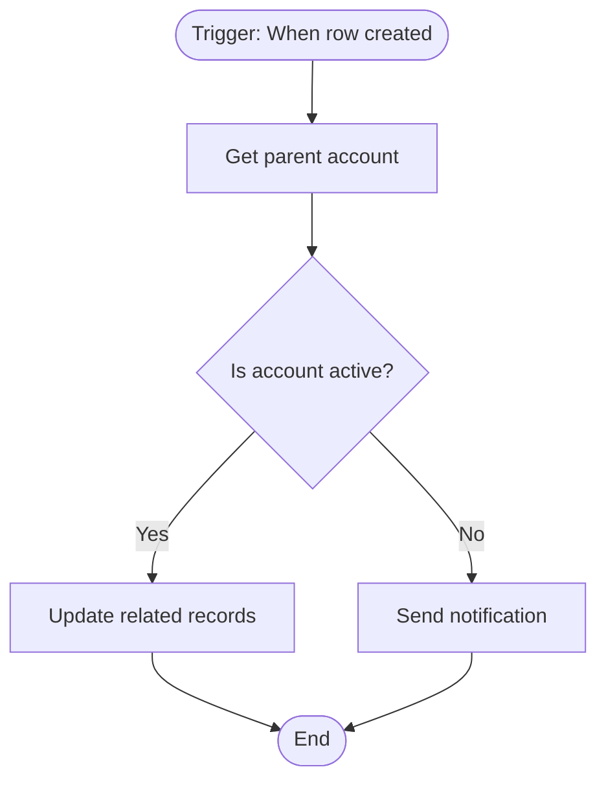

# Flows

## Purpose

This folder contains documentation for **Power Automate cloud flows** used in the RevOps system. Each flow is documented with its business logic, trigger conditions, schema definition, and visual diagrams to ensure maintainability and AI-safe knowledge transfer.

---

## Folder Structure

Each flow gets its own folder following **kebab-case** naming conventions:

```
Flows/
├── README.md (this file)
├── account-created-in-cumulus/
│   ├── README.md
│   ├── flow.logic.md
│   ├── flow.schema.json
│   └── diagram.mmd OR diagram.drawio
├── iso-3166-cumulus-account-to-account/
│   ├── README.md
│   ├── flow.logic.md
│   ├── flow.schema.json
│   └── diagram.mmd OR diagram.drawio
└── <flow-name-in-kebab-case>/
    ├── README.md
    ├── flow.logic.md
    ├── flow.schema.json
    └── diagram.mmd OR diagram.drawio
```

---

## Naming Conventions

### Folder Names
- **Format**: `kebab-case` (lowercase with hyphens)
- **Match**: Descriptive flow name, not necessarily the Power Automate display name
- **Examples**:
  - ✅ `account-created-in-cumulus`
  - ✅ `iso-3166-cumulus-account-to-account`
  - ✅ `email-notification-on-case-creation`
  - ❌ `Account created in Cumulus` (spaces not allowed)
  - ❌ `ISO3166_Account_Flow` (underscores/PascalCase not allowed)

### Flow Categories (Common Patterns)
- **Data Sync**: `<entity>-sync-to-<target>`
- **Notifications**: `<trigger>-notification-<channel>`
- **Automation**: `<entity>-auto-<action>`
- **Integration**: `<source>-to-<destination>`
- **Scheduled**: `<schedule>-<action>`

---

## Required Files per Flow

Every flow folder **MUST** contain:

### 1. `README.md` (Mandatory)
The overview and navigation hub for the flow.

**Template**:
```markdown
# <Flow Display Name>

## Overview
[1-2 sentence description of what this flow does and why it exists]

## Business Impact
[Who uses this? What business process does it support?]

## Trigger
- **Type**: [Manual/Automated/Scheduled/HTTP Request]
- **Condition**: [What event starts this flow?]
- **Frequency**: [Real-time/Daily/Hourly/On-demand]

## High-Level Logic
[3-5 bullet points of what the flow does]

## Key Actions
- [Action 1]
- [Action 2]
- [Action 3]

## Error Handling
[How does this flow handle failures? Any retry logic?]

## Dependencies
- **Tables**: [List Dataverse tables used]
- **Connections**: [SharePoint, Outlook, HTTP connectors, etc.]
- **Other Flows**: [Any flows that trigger this or are triggered by this]

## Documentation Files
- `flow.logic.md`: Detailed step-by-step logic
- `flow.schema.json`: Exported flow definition from Power Automate
- `diagram.mmd` or `diagram.drawio`: Visual workflow diagram

## Change History
- **YYYY-MM-DD**: [Change description]

## Known Issues / Limitations
[Any gotchas, quirks, or known limitations]

---

**Last Updated**: [Date]  
**Owner**: [Team/Person]
```

---

### 2. `flow.logic.md` (Mandatory)
Detailed step-by-step breakdown of the flow logic.

**Purpose**:
- Explain each action/condition in natural language
- Document FetchXML queries, expressions, and formulas
- Explain branching logic and loops
- Serve as a "source of truth" for business logic

**Template**:
```markdown
# Flow Logic: <Flow Name>

## Trigger
**Type**: [When a row is added, modified, or deleted / Manual / HTTP Request / Scheduled]

**Filter Conditions**:
- [Attribute filters, e.g., "Only when Status Reason = Active"]
- [Scope: Organization/User/Business Unit]

---

## Step-by-Step Actions

### 1. [Action Name]
**Type**: [Get a row / List rows / HTTP / Condition / Apply to each / etc.]

**Purpose**: [Why this step exists]

**Configuration**:
- **Table**: [Table name if applicable]
- **Filter**: [OData filter or FetchXML]
- **Select Columns**: [Columns retrieved]
- **Expression**: [If using dynamic content or formulas]

**Output**: [What data this produces]

---

### 2. [Condition: Check if ...]
**Type**: Condition

**Logic**:
```
IF [dynamic content] equals/contains/is not null [value]
THEN: [Branch description]
ELSE: [Branch description]
```

**Yes Branch**:
- [Actions taken if true]

**No Branch**:
- [Actions taken if false]

---

### 3. [Apply to Each: Loop through ...]
**Type**: Apply to each

**Input**: [Dynamic content array]

**Actions Inside Loop**:
- [Action 1]
- [Action 2]

---

[Continue for all actions...]

---

## FetchXML Queries

### Query 1: [Description]
```xml
<fetch>
  <entity name="tablename">
    <attribute name="column1" />
    <filter>
      <condition attribute="column2" operator="eq" value="value" />
    </filter>
  </entity>
</fetch>
```

---

## Expressions & Formulas

### Expression 1: [Description]
```
expression(dynamic('content'), 'formula')
```

**Purpose**: [What this calculates or transforms]

---

## Error Handling

- **Scope**: [Is there a Scope action wrapping critical steps?]
- **Run After**: [Do any actions run on failure?]
- **Notifications**: [Are errors emailed/logged?]

---

**Last Updated**: [Date]
```

---

### 3. `flow.schema.json` (Mandatory)
The exported JSON definition from Power Automate.

**How to Generate**:
1. Open flow in Power Automate
2. Click **Export** → **Package (.zip)**
3. Extract the `.zip` file
4. Locate the `definition.json` file (usually in `/Microsoft.Flow/flows/<flow-id>/`)
5. Copy to this folder and rename to `flow.schema.json`

**Purpose**:
- Version control for flow structure
- Backup for disaster recovery
- Schema reference for developers
- Enables automated analysis and testing

**⚠️ Security Warning**:
- **DO NOT** commit flows containing secrets, API keys, or connection references with sensitive data
- Redact any hardcoded credentials before committing
- Use environment variables and connection references instead

---

### 4. `diagram.mmd` OR `diagram.drawio` (Mandatory)

Visual representation of the flow logic.

**Formats**:
- **Mermaid (`diagram.mmd`)**: Preferred for text-based, version-controllable diagrams
- **Draw.io (`diagram.drawio`)**: Use for complex flows needing detailed visuals

**Mermaid Template**:


**Best Practices**:
- Show decision points clearly
- Label branches (Yes/No, True/False)
- Include error handling paths
- Keep diagrams simple and readable
- Use consistent shape meanings (diamonds for conditions, rectangles for actions)

---

## Flow Categories

Flows are organized by business function. Add category tags to `README.md` front matter (future enhancement):

### Categories
- **Data Sync**: Synchronizing data between systems
- **Notifications**: Email, Teams, or SMS alerts
- **Automation**: Automated business processes
- **Integration**: External system connections
- **Scheduled Jobs**: Batch processing and cleanup
- **Approvals**: Approval workflows
- **Error Handling**: Exception and retry flows

---

## Best Practices for Flow Documentation

### When Creating New Flow Documentation
1. ✅ **Always** create the folder with kebab-case naming
2. ✅ **Always** create all 4 mandatory files (README, logic, schema, diagram)
3. ✅ Document triggers, actions, and error handling in detail
4. ✅ Include business context (who uses it, why it exists)
5. ✅ Export and commit the `flow.schema.json` after each significant change
6. ✅ Update `diagram.mmd` when flow logic changes
7. ✅ Add change history entries to `README.md`

### When Updating Existing Flow Documentation
1. ✅ Update `flow.logic.md` if actions/conditions change
2. ✅ Re-export `flow.schema.json` from Power Automate
3. ✅ Update `diagram.mmd` to reflect new logic
4. ✅ Add change history entry to `README.md` with date and description
5. ✅ Review dependencies and update if new tables/flows are involved

### When Analyzing Flows
1. ✅ Start with `README.md` for high-level understanding
2. ✅ Read `flow.logic.md` for detailed step-by-step logic
3. ✅ Use `diagram.mmd` for visual flow understanding
4. ✅ Reference `flow.schema.json` only for schema details (connectors, parameters, etc.)

---

## Migration Guide: Normalizing Existing Flows

If you encounter flow folders with **non-kebab-case** names:

### Step 1: Create New Kebab-Case Folder
```
Flows/account-created-in-cumulus/
```

### Step 2: Move All Files
Move all files from the old folder to the new folder:
- `*.md` files
- `*.json` files
- `*.drawio` or `*.mmd` files

### Step 3: Verify Mandatory Files
Ensure the folder contains:
- `README.md`
- `flow.logic.md`
- `flow.schema.json`
- `diagram.mmd` OR `diagram.drawio`

If missing, create them using the templates above.

### Step 4: Do NOT Delete Old Folder
Per documentation governance rules:
- **NEVER** delete folders or files
- Leave old folder as-is (for audit trail)
- Future cleanup can archive old folders to `_archive/` if needed

---

## AI Agent Guidelines

When working with flows in this folder:

### ✅ DO
- Create new flow folders using kebab-case
- Generate all 4 mandatory files when documenting a new flow
- Update `flow.logic.md` when flow changes
- Re-export `flow.schema.json` after significant updates
- Use Mermaid diagrams for visual representation
- Add change history to `README.md`
- Link flows to related Tables, Plugins, and Power Pages components

### ❌ DO NOT
- Delete existing flow folders (even if renamed)
- Skip mandatory files (all 4 must exist)
- Use spaces, underscores, or PascalCase in folder names
- Commit secrets or API keys in `flow.schema.json`
- Modify `flow.schema.json` manually (always export fresh from Power Automate)
- Create flows without business context documentation

---

## Known Flows in This Repository

1. **account-created-in-cumulus**: Syncs Cumulus Account creation to Dynamics Account
2. **iso-3166-cumulus-account-to-account**: Maps ISO2 country codes to region codes on Account/Case

*(Update this list as new flows are documented)*

---

## TODO / Future Enhancements

- [ ] Add YAML front matter to README files for metadata (category, owner, status)
- [ ] Create `_schemas/flow-template/` with template files
- [ ] Build automated validation script to check for missing mandatory files
- [ ] Create Mermaid diagram generator from `flow.schema.json`
- [ ] Add flow dependency graph (which flows trigger which)
- [ ] Document connection references and environment variables
- [ ] Create runbook for flow failures (troubleshooting guide)

---

**Last Updated**: December 15, 2025  
**Maintained By**: RevOps Development Team